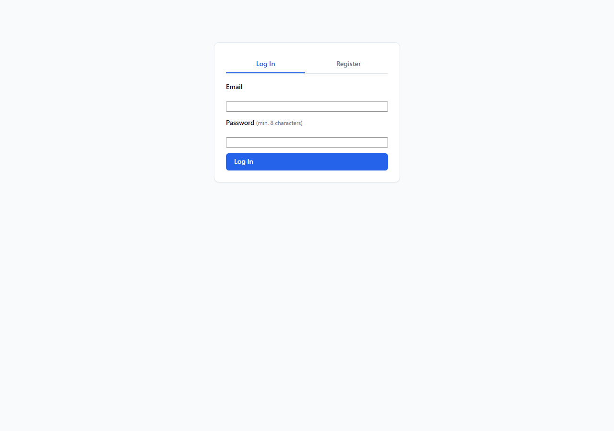
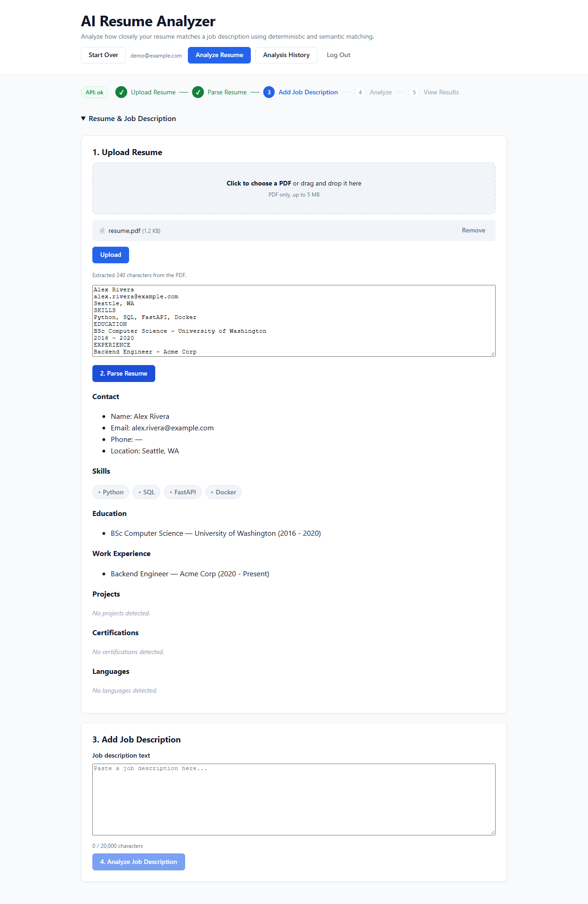
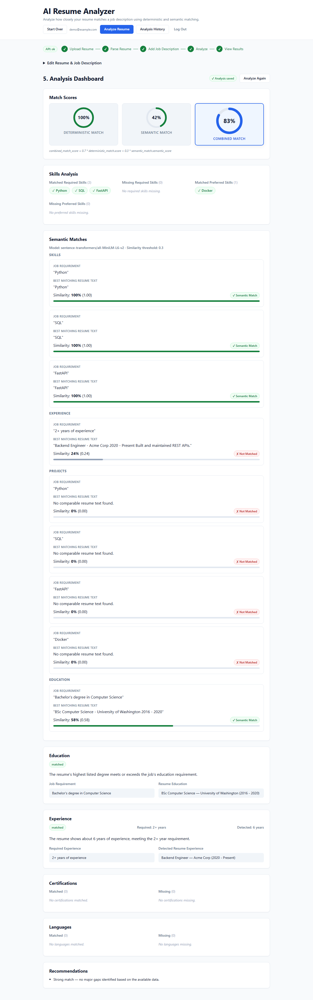
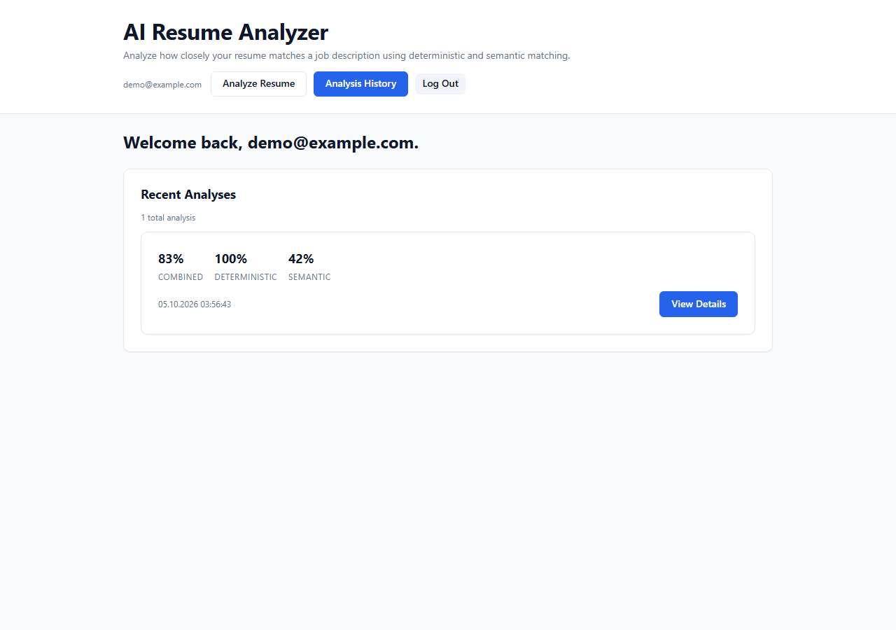

# AI Resume Analyzer

[](https://github.com/agahatay/ai-resume-analyzer/actions/workflows/ci.yml)

## Screenshots

Captured with the e2e fixture resume (fake data: "Alex Rivera") and a demo account.

| Login | Dashboard after upload |
|---|---|
|  |  |

| Analysis result | Analysis history |
|---|---|
|  |  |

## Structure

- `backend/` — FastAPI application
- `frontend/` — React + TypeScript (Vite) application

## Backend

Requires Python 3.10+ (tested on 3.10.8) and a running PostgreSQL. The quickest option is the compose `postgres` service, which is published on `127.0.0.1:5432` (run from the repo root; it needs the root `.env`, see [Docker](#docker-phase-12)):

```bash
docker compose up -d postgres
```

Or point `DB_*` in `backend/.env` at your own PostgreSQL 18 install.

```bash
cd backend
python -m venv .venv
.venv\Scripts\activate          # Windows
# source .venv/bin/activate     # macOS / Linux
pip install -r requirements.txt
copy .env.example .env          # macOS / Linux: cp .env.example .env
```

Replace the `change_me` placeholders in `backend/.env`:

- `JWT_SECRET_KEY`: generate one with `python -c "import secrets; print(secrets.token_hex(32))"`
- `DB_PASSWORD`: any strong password. If you use the compose `postgres` service, it must match the `DB_PASSWORD` in the repo-root `.env`.

```bash
uvicorn app.main:app --reload
```

API available at http://localhost:8000, health check at `GET /api/health`.

The first semantic match downloads the sentence-transformers model (`all-MiniLM-L6-v2` by default), so the first match request takes noticeably longer. Later requests use the local model cache.

## Frontend

```bash
cd frontend
copy .env.example .env
npm install
npm run dev
```

App available at http://localhost:5173.

`npm install` can rewrite `frontend/package-lock.json`. The current lock file is in sync with `package.json`; npm's newer version adds metadata such as `"peer": true` to the `node_modules/picomatch` entry. Use `npm ci` to install exactly what the lock file records without changing it.

## Authentication (Phase 10)

Resumes, job descriptions and analyses belong to a user. Every endpoint that reads or writes them requires a JWT bearer token, and a user can only ever see or change their own data.

- **10A - JWT foundation.** Argon2id password hashing (`backend/app/core/security.py`), HS256 access tokens signed with `JWT_SECRET_KEY`, a `users` table, and `POST /api/auth/register`, `POST /api/auth/login`, and `GET /api/auth/me`. `GET /api/auth/me` is backed by the shared `get_current_user` dependency.
- **10B - ownership and route protection.** Resume, job description and analysis endpoints require a bearer token. Ownership comes from the verified token subject, never from a request body. A resource owned by another user returns the same 404 as a nonexistent one, so ids cannot be probed. `ResumeAnalysis` has no `user_id`; its owner is `analysis.resume.user_id`.
- **10C - frontend session handling.** `AuthProvider` (`frontend/src/context/AuthContext.tsx`) is the single source of auth state, read through `useAuth()`. On startup and refresh, a stored token is verified with `GET /api/auth/me` before it is trusted. Logout, a stored token that fails verification, and a 401 in the middle of a session all return to the login screen; the last one shows a "session expired" message.

**Token storage (known limitation).** The access token is kept in `localStorage` under `ai-resume-analyzer.access_token`, so a page refresh does not log the user out. Any JavaScript running on the origin can read it, which means any XSS bug would expose it. This is an accepted trade-off for the current stage, not a production design. For production, use **HttpOnly cookies with a short-lived access token and a rotating refresh token**: script never sees the token, and refresh tokens can be revoked server-side. That change touches the backend (cookie issuing, refresh and revocation endpoints) and the frontend (drop the `localStorage` token), and cookie-authenticated requests then need CSRF protection.

## Docker (Phase 12)

Runs the whole stack - PostgreSQL, backend, frontend - via Docker Compose. Requires Docker Desktop.

```bash
copy .env.example .env      # then fill in DB_PASSWORD and JWT_SECRET_KEY
docker compose build
docker compose up -d
docker compose down          # stop containers, keep data
docker compose down -v       # stop containers AND delete the postgres_data volume - all DB data is lost
```

- Frontend: http://localhost:5173 (nginx serving the Vite production build)
- Backend: http://localhost:8000, health checks at `GET /api/health` and `GET /api/health/db`
- PostgreSQL: bound to `127.0.0.1:5432` on the host for local `psql`/GUI access only; inside Compose, the backend reaches it via the `postgres` service hostname, never `localhost`.
- The backend container runs `alembic upgrade head` on every startup (before uvicorn starts) so the schema is always current - there is no `Base.metadata.create_all()` anywhere.
- The `postgres_data` and `hf_cache` named volumes persist database data and the downloaded sentence-transformers model across `docker compose down` / `up` and restarts. Only `down -v` removes them.
- All secrets (`DB_PASSWORD`, `JWT_SECRET_KEY`) come from your local `.env` (gitignored), never from `docker-compose.yml` or the Dockerfiles.

## CI (Phase 13A)

GitHub Actions (`.github/workflows/ci.yml`) runs on every pull request and on pushes to `main`/`master`, as four jobs:

- **Backend** — installs `backend/requirements.txt`, runs against a real PostgreSQL 18 service container, applies migrations (`alembic upgrade head`), checks the models and migration history haven't drifted (`alembic check`), then runs the full `pytest` suite. `JWT_SECRET_KEY` is generated fresh inside the job (never checked in); the database password is a fixed CI-only throwaway value for an ephemeral, network-isolated container. No `.env` file (local or root) is used.
- **Frontend** — `npm ci`, `tsc -b`, `npm run build`, and `npm run lint` (ESLint, added in this phase — see `frontend/eslint.config.js`).
- **E2E** — boots a real PostgreSQL + FastAPI backend + a production-built, previewed frontend, then runs the Playwright suite in `frontend/e2e/` end to end: register, login, resume upload, resume parsing, job description parsing, matching, and analysis history/detail. Only runs once the backend and frontend jobs pass. On failure, the Playwright report, screenshots/videos, and server logs are uploaded as workflow artifacts.
- **Docker** — validates `docker compose config` and builds the backend and frontend images (with GitHub Actions layer caching, since the backend image includes torch/sentence-transformers) to catch Dockerfile/compose regressions, and confirms the PostgreSQL container starts and reports healthy. Images are tagged with both `:ci` and the commit SHA (`${{ github.sha }}`) so a build can be traced back to the commit that produced it; no images are pushed anywhere.

## Production / Deployment Preparation (Phase 13B)

Docker images and a production Compose file exist so a real deployment (a future phase) can start from a known-good, already-validated baseline. **Nothing in this section deploys anywhere** - it documents and locally validates what a deployment would use.

### Architecture

Three services, unchanged from the dev stack's shape (see `## Docker (Phase 12)` above): PostgreSQL 18, the FastAPI backend (runs `alembic upgrade head` on every container start, then `uvicorn`), and the React/Vite frontend (built to static files, served by nginx, running as a non-root user via `nginxinc/nginx-unprivileged`). In production, the backend and frontend are separate images built once and deployed by tag - not rebuilt from source on the host, unlike `docker-compose.yml`'s dev workflow.

### Environment separation

| Environment | Config source | Secrets |
|---|---|---|
| Local dev (host, no Docker) | `backend/.env`, `frontend/.env` (gitignored, copied from `.env.example` files) | Whatever you put in your own `.env` - never committed |
| Local dev (Docker Compose) | repo-root `.env` (gitignored, copied from `.env.example`) | Same - only read by `docker-compose.yml` on your machine |
| CI (GitHub Actions) | Hardcoded/generated inline in `.github/workflows/ci.yml` | `JWT_SECRET_KEY` is generated fresh per run (`openssl rand -hex 32`, never checked in); DB password is a fixed throwaway value for an ephemeral, network-isolated service container |
| Production (future) | Real runtime environment variables / secrets manager (platform-specific - not decided yet, since no cloud provider is chosen in this phase) | Real, unique `DB_PASSWORD` and `JWT_SECRET_KEY`, injected by whatever runs the containers - never a file checked into this repo |

`docker-compose.prod.yml` (below) is the local stand-in for "production config shape" - it has no defaults for secrets and fails to start without them, but you still supply those values yourself, locally, for validation only.

### Image tagging

Tag both images with the git commit SHA (traceable, immutable) and, at release time, a semantic version; `latest` is for human convenience only and should never be the tag a deployment pins to.

```bash
# From the repo root:
SHA=$(git rev-parse --short HEAD)
VERSION=v0.1.0   # bump per your own versioning decisions

docker build -t ai-resume-analyzer-backend:$SHA -t ai-resume-analyzer-backend:$VERSION -t ai-resume-analyzer-backend:latest ./backend
docker build --build-arg VITE_API_BASE_URL=https://api.example.com \
  -t ai-resume-analyzer-frontend:$SHA -t ai-resume-analyzer-frontend:$VERSION -t ai-resume-analyzer-frontend:latest ./frontend
```

No images are pushed to any registry by these commands or by CI - pushing/publishing is out of scope for this phase.

### Running the production Compose file locally

```bash
copy .env.prod.example .env.prod      # then fill in real-looking local values
docker compose -f docker-compose.prod.yml --env-file .env.prod config   # validate first
docker compose -f docker-compose.prod.yml --env-file .env.prod up -d
docker compose -f docker-compose.prod.yml --env-file .env.prod down     # keeps data
```

- Migrations: identical behavior to dev - `backend`'s entrypoint runs `alembic upgrade head` before `uvicorn` starts, so the schema is always current; there is no separate "migration step" to remember.
- Persistent volumes: `postgres_data` and `hf_cache`, same as dev - only `down -v` removes them.
- Health endpoints: `GET /api/health` (backend liveness) and `GET /api/health/db` (DB connectivity) back both the backend's own `HEALTHCHECK` and `depends_on: condition: service_healthy` for the frontend.
- `docker-compose.prod.yml` never publishes PostgreSQL's port to the host - only `backend` can reach it, over the internal Compose network.

### Secrets and configuration required for a real deployment

Never commit real values for any of these - `.env.prod.example` only has placeholders, exactly like the existing `.env.example` files.

**Secrets (must be unique, random, and kept out of git):**
- `DB_PASSWORD` — PostgreSQL password.
- `JWT_SECRET_KEY` — signs access tokens; rotating it invalidates every existing session. Generate with `openssl rand -hex 32`.

**Configuration (not secret, but must be set deliberately per environment):**
- `SEMANTIC_MODEL_NAME` — sentence-transformers model id; changing it changes the semantic-matching layer's behavior, so pin it deliberately rather than relying on the code default drifting.
- `SEMANTIC_SIMILARITY_THRESHOLD` — see `backend/app/services/semantic_matcher.py` for how this default was chosen; don't change it without re-validating against real resume/JD pairs.
- `DB_HOST` / `DB_NAME` / `DB_USER` — wherever the production database actually lives; `docker-compose.prod.yml` defaults `DB_HOST` to the Compose service name, which only makes sense if Postgres is co-located in the same Compose project.
- `CORS_ORIGINS` — must be the real frontend origin(s), comma-separated; `docker-compose.prod.yml` has no default and refuses to start without it, since a production backend accepting any/no CORS origin is a real exposure.
- `VITE_API_BASE_URL` — the browser-reachable backend URL, baked into the frontend image at **build time** (see the tagging commands above), not a container-runtime variable — it cannot be changed by editing `docker-compose.prod.yml`'s `environment:`, only by rebuilding the frontend image with a different `--build-arg`.

### Still required before an actual deployment

This phase deliberately stops short of deploying. Still needed: choosing a hosting platform/container registry, a TLS-terminating reverse proxy or load balancer in front of the frontend/backend, a real secrets manager (or platform env-var injection) instead of `.env.prod`, a chosen semantic version/release process, and a decision on where the production PostgreSQL instance actually runs (managed DB vs. a container with real backups).
